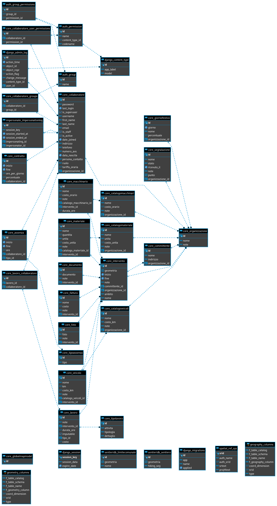

# Reference documentation
## Releases
| Tag    | Data       | Descrizione                                                                                                                                                                                                                                                                          |
|--------|------------|--------------------------------------------------------------------------------------------------------------------------------------------------------------------------------------------------------------------------------------------------------------------------------------|
| v1.0.1 | 04.10.2021 | Aggiunto link per documentazione nell'header, miglioramento documentazione, aggiunto logo, migliorata la visualizzazione degli elementi dei cataloghi, il campo `is_staff` è ora gestito automaticamente, contratti possono non avere la data finale, migliore gestione dei permessi |
| v1.0.0 | 25.09.2021 | Prima release "pubblica", utilizzabile dalle OTR                                                                                                                                                                                                                                     |

## Modello dati
<figure>
  
  <figcaption>Modello dati</figcaption>
</figure>
