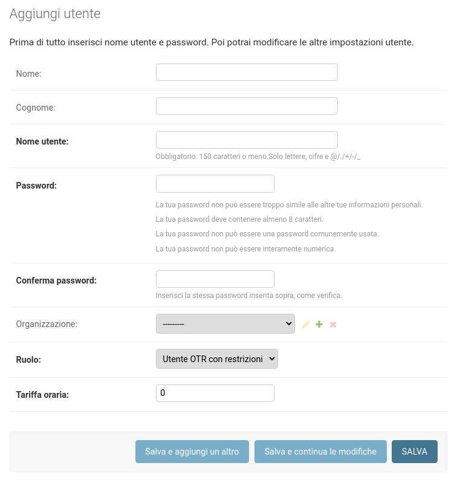

# Manuale utente IBEX
## Interfaccia
## Creazione di un utente/collaboratore
Premendo su `aggiungi` nel menu `utente`, appare il form per la creazione di un nuovo utente.
<figure>
  
  <figcaption>Form "Aggiungi Utente"</figcaption>
</figure>

!!! warning
    Solamente gli utenti con ruolo `amministratore globale` o `amministratore OTR` sono abilitati
    a creare nuovi utenti

### Spiegazione campi
| Campo             | Descrizione                                                                                             |
|-------------------|---------------------------------------------------------------------------------------------------------|
| Nome              | Nome reale del collaboratore                                                                            |
| Cognome           | Cognome reale del collaboratore                                                                         |
| Nome utente       | Nome utente utilizzato per il login nell'applicazione                                                   |
| Password          | Password per il login nell'applicazione                                                                 |
| Conferma password | Conferma della password                                                                                 |
| Organizzazione    | Di quale OTR fa parte il collaboratore (il contenuto varia in base al ruolo di chi svolge l'operazione) |
| Ruolo             | Ruolo del collaboratore (il contenuto varia in base al ruolo di chi svolge l'operazione)                |
| Tariffa oraria    | Tariffa oraria in CHF del collaboratore utilizzata per i calcoli di costo degli interventi              |

### Ruoli
Ogni utente dell'applicazione deve avere un ruolo assegnato.
I seguenti ruoli sono disponibili nell'applicazione:

| Ruolo                      | Descrizione                                                                                                                                                                                                                     |
|----------------------------|---------------------------------------------------------------------------------------------------------------------------------------------------------------------------------------------------------------------------------|
| Amministratore globale     | Utente con la possibilità di vedere e modificare tutti i dati di tutte le organizzazioni                                                                                                                                        |
| Amministratore OTR         | Utente con la possibilità di vedere e modificare tutti i dati della propria organizzazione                                                                                                                                      |
| Utente OTR con restrizioni | Utente con accesso limitato ai dati della propria organizzazione. Ruolo tipicamente utilizzato dal capo operaio che esegue le registrazioni degli interventi nell'applicazione ma non deve poter modificare i dati degli utenti |
| Utente senza login         | Utente senza la possibilità di utilizzare l'applicazione. Serve per poter registrare i lavori svolti, le assenze ecc.                                                                                                           |

## Creazione di un intervento
## Gestione assenze e vacanze
## Generazione reportistica
## Gestione dei cataloghi
## Creazione di una segnalazione
